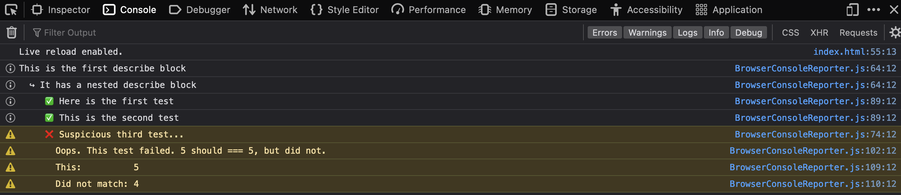

# SirTestALots

SirTestALots is a JavaScript testing library. It's API is modeled after Jest's.

## Goals

The main goal of this project is to develop a JavaScript library from scratch and understand what issues the Jest team might have faced as they built Jest.

## Contributing

This project is still under early development. There are no dependencies to install. Currently, test results report to the web browser console. To show this functionality, open `src/tests/index.html` in your browser. You should see something like this:

If you are interested in going along on this learning adventure, feel free to open up a Github issue with what you'd like to work on.
